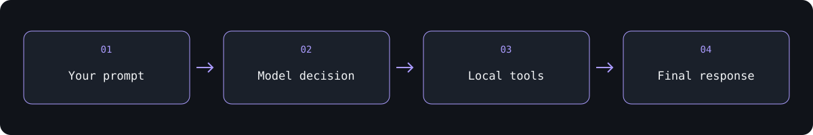
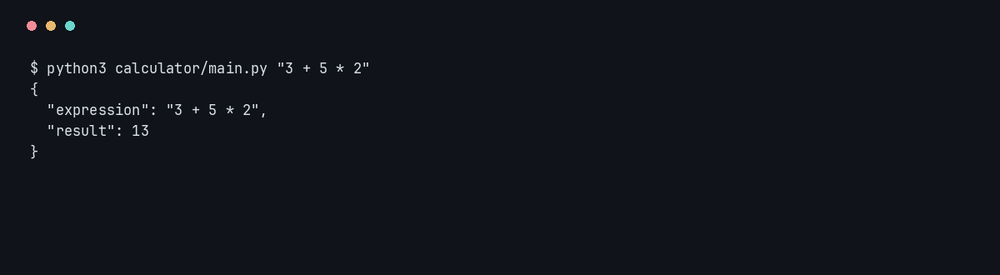

# Workbench — AI Coding Agent

**A command-line agent that can inspect, edit, and run a local calculator project.**

Give the agent a task in plain language. It sends the conversation to OpenRouter, executes supported tool calls inside a configured workspace (default: `calculator/`), and returns the results to the model until it produces a final response or reaches its 20-iteration limit.

## One-line launch

```bash
./launch "Explain how the calculator works" --read-only
```

The launcher uses uv to prepare the Python environment automatically. Run `./launch` without arguments to enter a task interactively. All CLI options work with the launcher; it can also be invoked by absolute path from another directory. Set `OPENROUTER_API_KEY` in your environment or the project `.env` before sending a task.

##  Give it a task

Requires **Python 3.13+**, **uv**, and an **OpenRouter API key**.

```bash
uv sync
```

Create a local `.env` file containing your own key (`.env` is ignored by Git):

```dotenv
OPENROUTER_API_KEY=your_key_here
```

```bash
uv run main.py "Explain how the calculator handles operator precedence"
uv run main.py "Evaluate 3 + 5 using the calculator" --verbose
```

The default model is `openrouter/free`; set `OPENROUTER_MODEL` or pass `--model` to choose another. Availability and request limits depend on the provider. Verbose mode prints step counts, token usage when supplied, and tool names.

## Work on your own project

```bash
uv run main.py "Explain this project" --workspace ../folio-static-site --read-only
uv run main.py "Fix the bug and run relevant tests" --workspace ./calculator --max-steps 30
uv run main.py "Inspect the calculator" --read-only --transcript conversation.json
```

`--read-only` exposes only listing and reading tools and also blocks mutation requests in the dispatcher. Normal mode allows file overwrites and Python execution. Inspect the workspace before using normal mode. Python subprocesses have a 30-second timeout; each output stream is truncated to 10,000 bytes. File reads are limited to 10,000 characters. These bounds do not limit subprocess disk usage or isolate executed code from the host.

Transcripts are opt-in JSON conversations, including tool results and file contents. Keep them private when inspecting sensitive projects. Interrupted or failed runs also save the available conversation. Provider failures and exhausted step limits return a nonzero exit status; Ctrl+C returns 130.

## Run the automated checks

```bash
uv run python -m unittest discover -s tests -v
uv run calculator/tests.py
```

These checks need no API key and make no provider requests. They cover argument validation, workspace traversal and symlinks, read-only enforcement, Python execution, tool conversations, empty responses, and step limits.

##  A conversation with tools



| Tool | What it does |
| --- | --- |
| `get_files_info` | List files and directories |
| `get_file_content` | Read file contents |
| `write_file` | Write a file |
| `run_python_file` | Execute a Python file with a 30-second timeout |

`call_function.py` validates tool arguments and dispatches requests into the configured workspace. The default calculator path is anchored to the project, so launching from another directory works. File tools resolve symlinks and reject paths outside that directory. Python execution is a subprocess, so these checks are not an operating-system sandbox. Run the course agent against disposable local work you are comfortable letting it modify.

##  Explore without an API request

The bundled calculator works independently of the model:

```bash
uv run calculator/main.py "3 + 5 * 2"
```



[Calculator documentation](calculator/README.md) · [Tool definitions](functions/) · [System prompt](prompts.py)

##  What this project teaches

Function schemas, tool dispatch, conversation history, subprocess execution, and a bounded agent loop. The root `test_*.py` files are legacy manual tool demonstrations; some write files or run code. The automated tests in `tests/` use temporary workspaces and simulated provider responses.

---

Built by **[Abdulrahman M. Yaqyn](https://yaqyn.dev)** through the [Boot.dev](https://www.boot.dev) curriculum.
