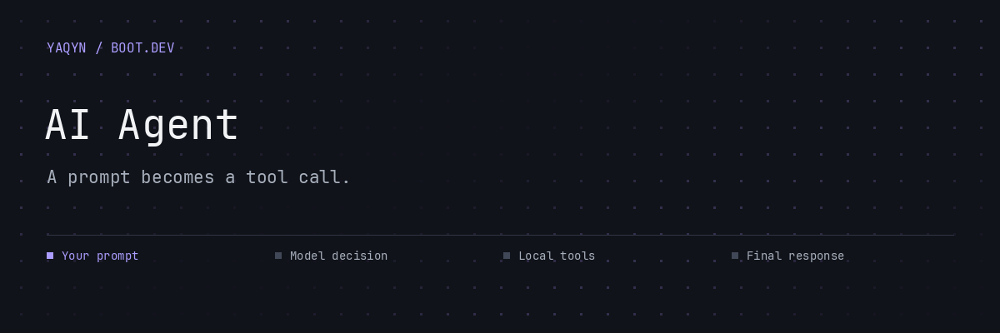

# AI Agent

**A command-line agent that can inspect, edit, and run a local calculator project.**

Give the agent a task in plain language. It sends the conversation to OpenRouter, executes supported tool calls inside `calculator/`, and returns the results to the model until it produces a final response or reaches its 20-iteration limit.

##  Give it a task

Requires **Python 3.13+**, **uv**, and an **OpenRouter API key**.

```bash
uv sync
```

Create a local `.env` file containing your own key (`.env` is ignored by Git):

```dotenv
OPENROUTER_API_KEY=your_key_here
```

```bash
uv run main.py "Explain how the calculator handles operator precedence"
uv run main.py "Evaluate 3 + 5 using the calculator" --verbose
```

The source selects `openrouter/free`. Availability and request limits depend on the provider. Verbose mode prints token usage, tool arguments, and tool results.

##  A conversation with tools


| Tool | What it does |
| --- | --- |
| `get_files_info` | List files and directories |
| `get_file_content` | Read file contents |
| `write_file` | Write a file |
| `run_python_file` | Execute a Python file with a 30-second timeout |

`call_function.py` dispatches tool requests and sets their working directory to `./calculator`. The file tools check paths against that directory. Python execution is a subprocess, so these checks are not an operating-system sandbox. Run the course agent against disposable local work you are comfortable letting it modify.

##  Explore without an API request

The bundled calculator works independently of the model:

```bash
uv run calculator/main.py "3 + 5 * 2"
```


[Calculator documentation](calculator/README.md) · [Tool definitions](functions/) · [System prompt](prompts.py)

##  What this project teaches

Function schemas, tool dispatch, conversation history, subprocess execution, and a bounded agent loop. The `test_*.py` files are manual tool demonstrations; some write files or run code, so inspect them before running them.

---

Built by **[Abdulrahman M. Yaqyn](https://yaqyn.dev)** through the [Boot.dev](https://www.boot.dev) curriculum.
